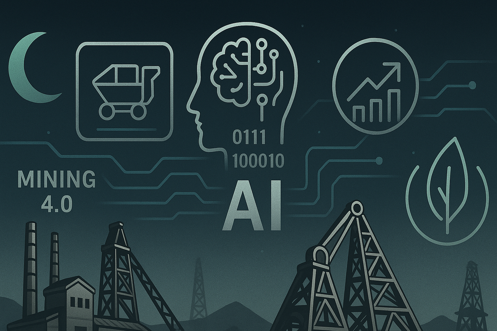

# Radar Profesional - Minería 4.0 & Tecnología Industrial

Este repositorio centraliza recursos, noticias, cursos, papers y eventos relacionados con Minería 4.0, automatización industrial, inteligencia artificial aplicada a procesos industriales, sostenibilidad y transformación digital.

## Estructura del repositorio

- `/docs/` — Guías técnicas y términos clave  
- `/papers/` — Artículos y papers científicos descargados  
- `/cursos/` — Información y enlaces de cursos y diplomados  
- `/eventos/` — Detalles y enlaces de webinars y eventos  
- `/plantillas/` — Formatos para resúmenes técnicos y bitácora  
- `/bitacora/` — Apuntes y resúmenes personales

## Cómo usar este repositorio

- Cada actualización del Radar Profesional agrega nuevos recursos o actualiza la información en las carpetas correspondientes.  
- En `/bitacora/` se guardan las notas personales y aprendizajes.  
- Se recomienda actualizar periódicamente para mantener todo vigente.

---

¡Bienvenida/o a tu espacio personal de crecimiento profesional!

